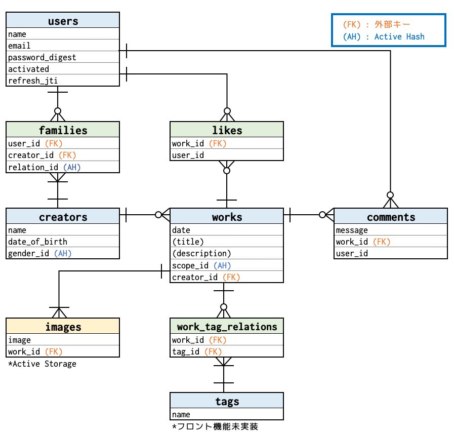

# サービス概要
こどもの作品を残し、家族みんなで共有できるWebサービスです。 
PCはもちろん、スマホからも扱いやすいUIにしています。 
 
サービス名は「tottoko（トットコ）」 
写真を「撮る」という意味と、残こしておくという意味での「とっておく」から命名。 
 
https://tottoko.su-dx.com

# システム全体構成

# 使用技術

## フロントエンド
React + Typescriptを使用したシングルページアプリケーション（以下、SPA）を採用。 
本番環境ではCDN（Cloud Front）を使用し、SPAで不利となる初期表示の遅延を改善。 

### 使用した主要ライブラリ
| ライブラリ名 | バージョン | 説明 |
|----------------|------------|------|
| react | 17.02 |  |
| typescript | 4.5.5 |  |
| chakra-ui | 1.8.5 | UIコンポーネントライブラリ |
| react-router-dom | 6.2.1 | ルーティングライブラリ |
| ky | 0.29.0 | FetchベースのHTTPクライアントライブラリ |
| react-query | 3.34.16 | データフェッチングライブラリ サーバーデータのキャッシュ機構として使用|
| react-hook-form | 7.27.1 | フォームバリデーションライブラリ  登録・編集系画面で使用|
| reduxjs/toolkit | 1.7.2 | 状態管理ライブラリ 認証情報とログインユーザーの情報のみ管理 |

### アプリ特徴
- バックエンドで生成したアクセストークン(JWT)やリフレッシュトークン(Cookie,JWT)を用いてリソースのアクセス制限やセッション維持を実現。 
→ サイレントリフレッシュ機能や起動時自動ログイン機能を実装。
- `chakra-ui`を使用し、チェックボックスカードのUIコンポーネントを実装。
- `keen-slider`、`chakra-ui`を使用し、カルーセルUIコンポーネントを実装。
- `react-query`を使用し、コメントの「もっと見る」機能を実装。

### 開発環境特徴
- `create-react-app`を使用し、プロジェクトテンプレートを作成。
- エディタは`VSCode`を使用し、VSCodeからブラウザ起動・デバッグできるよう設定。
- `ESLint`、`StyleLint`、`Prettier`を導入・設定し、VSCodeと連携。
- `simple-git-hooks`、`lint-staged`を導入し、コミット時にコード解析＆テストを自動実行できるよう設定。

### CI / CD
GitHubのmainリポジトリにコードがマージされた際、GitHub Actionsで以下内容を実施。
- `ESLint`, `StyleLint`を実行し、テストを実施。
- 不備がなければProduction Buildし、本番環境用のコードを生成、S3に配備。
- 配備したコードをユーザーが取得できるよう、Cloud Frontのキャッシュを無効化。

## バックエンド
RailsのAPIモードを使用。
Dockerを使用したコンテナベースで開発し、REST APIを提供。 
本番環境でもそのままコンテナを使用できるようAWSのECS（Fargate）を使用。 
負荷分散装置（Application Load Balancer）を使用することでスケールアウト可能な構成を実現。 
画像はS3に保存し、メール配信はAWS SESを使用。

### 使用した主要ライブラリ
| ライブラリ名 | バージョン | 説明 |
|----------------|------------|------|
| rails | 6.1.4.1 | APIモードで使用 |
| bcrypt | 3.1.16 | パスワードのハッシュ化ライブラリ |
| jwt | 2.3.0 | JWT作成・検証ライブラリ |
| rack-cors | 1.1.1 | CORS設定ライブラリ |
| image_processing | 1.12.1 | 画像処理ライブラリ サブネイル作成に使用 |
| jbuilder | 2.11.2 | JSON形式のデータを出力するライブラリ |
| kaminari | 1.2.2 | ページングライブラリ 一覧系を出力する機能で使用 |

### アプリ特徴
- 以下機能をJWTを用いて実現。
  - ユーザー認証（アクセストークン、リフレッシュトークンの実装）
  - アカウントアクティブ化 ※ JWT付きURLをログインIDのメールアドレスに送ることでメールアドレスの有効性を検証
  - パスワードリセット
  - メールアドレス変更
- 画像保存はRailsの`Active Storage`を使用。
- マスターデータはDBを使用せず`active_hash`を使用してメモリ管理。

### 開発環境特徴
- `docker`及び、`docker-compose`を用いて、コンテナ開発環境を構築。 
※イメージ軽量化のためベースイメージは`alpine`を使用。
- `rspec`、`factory_bot`を使用してテスト実施。
- デバックは`pry`を使用。

### CI / CD
GitHubのmainリポジトリにコードがマージされた際、GitHub Actionsで以下内容を実施。
- マージしたリポジトリの内容からdockerイメージを作成。
- `docker-compose`を使用し、作成したdockerイメージをテスト(rspec)。
- 不備がなければAWS ECRにdockerイメージを登録。
- 登録したdockerイメージを使用し、ECS(Fargate)のタスクを新しく起動。 
※既存タスクは停止させる

# アプリ機能
## 機能一覧
こちらを参照。

## 動作イメージ（抜粋）

### 作品一覧表示
お子さまによる作品絞り込みと、ページネーションを実現。 
（※ 絞り込みはURLと紐付かせているため、ブラウザバック可能） 

 
 

### 作品詳細表示
カルーセルUI、画像最大表示、いいねボタン、画像ダウンロード、コメントの「もっと見る」を実現。 

 
 

### 作品投稿
画像プレビュー＆削除、画像圧縮、画像種類（png, jpeg）チェック等を実現。 

 
 

### お子さま追加

 
 

### 家族の追加
お子さまとの関係（パパ、ママ、おじいちゃん、おばあちゃん、など）により作品に対する権限が決定する。 
（※ 関係がパパ、ママ、子ども自身の場合、作品の投稿・編集・削除の権限があるが、それ以外は閲覧権限のみ）
 

 
 

### スマホ表示

 
 

# ER図

