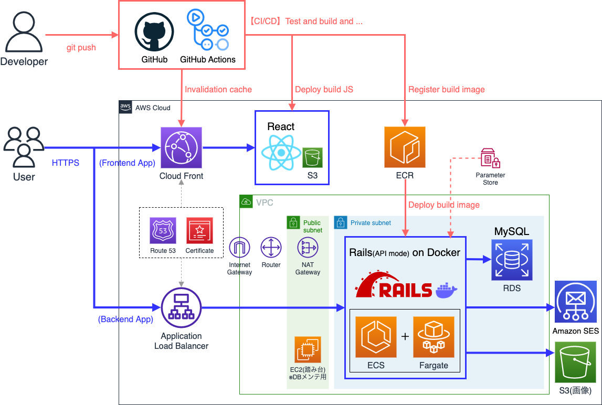

# ポートフォリオ説明

## システム構成図

## 使用技術

### フロントエンド

| 使用した主要ライブラリ | バージョン | 説明 |
|----------------|------------|------|
| react | 17.02 |  |
| typescript | 4.5.5 |  |
| chakra-ui | 1.8.5 | UIコンポーネント |
| react-router-dom | 6.2.1 | ルーティングライブラリ |
| ky | 0.29.0 | FetchベースHTTPクライアント |
| react-query | 3.34.16 | データフェッチングライブラリ |
| react-hook-form | 7.27.1 | フォームバリデーションライブラリ |
| reduxjs/toolkit | 1.7.2 | 状態管理ライブラリ（ログイン管理のみ） |

#### アプリ特徴
- JWTを使用したユーザー認証を採用。 
※ アクセストークン(JWT)やリフレッシュトークン(JWT)の生成はバックエンドのRailsで実装。
- リフレッシュトークンを使用し、サイレントリフレッシュや起動時自動認証を実装。
- `chakra-ui`を使用し、チェックボックスカードのUIコンポーネントを実装。
- `keen-slider`、`chakra-ui`を使用し、カルーセルUIコンポーネントを実装。
- `react-query`を使用し、コメントの「もっと見る」機能を実装。

#### 開発環境
- `create-react-app`を使用し、プロジェクトテンプレートを作成。
- エディタは`VSCode`を使用し、VSCodeからブラウザ起動・デバッグできるよう設定。
- `ESLint`、`StyleLint`、`Prettier`を導入・設定し、VSCodeと連携。
- `simple-git-hooks`、`lint-staged`を導入し、コミット時にコード解析＆テストを自動実行できるよう設定。
